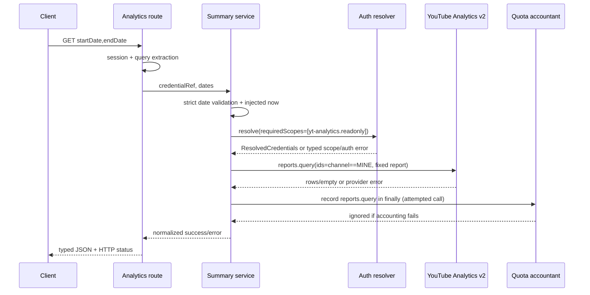

# Design: YouTube Analytics Summary

## Decision summary

Implement one read-only vertical slice: `GET /api/youtube/analytics` delegates to an injected `youtube-analytics-summary` core service, which validates a UTC calendar range, resolves credentials with the analytics scope requirement, makes exactly one YouTube Analytics v2 `reports.query`, normalizes the result, and records the attempted call observationally. The route owns HTTP status and session extraction; the core owns domain contracts and provider-independent behavior.

The design follows the existing `video-metadata` / `playlist-management` dependency-injection pattern and does not alter the existing OAuth grant list.

## Boundaries and contracts

### Files and responsibilities

| Boundary | Responsibility |
|---|---|
| `src/lib/auth.ts` | Export `YOUTUBE_ANALYTICS_READ_SCOPE`; leave `YOUTUBE_SCOPES` and its derived string unchanged. |
| `src/lib/quota/accountant.ts` | Add `"reports.query": 1` to `YOUTUBE_QUOTA_COSTS`; do not add enforcement. |
| `youtube-analytics-summary/contracts.ts` | Export input, row, success, error, and injected dependency types. No `channelId` appears in input. |
| `youtube-analytics-summary/schemas.ts` | Strict Zod schemas for input and normalized output; date semantics that require the clock remain in the service. |
| `adapters/youtube-analytics-api.ts` | Construct an authenticated `google.youtubeAnalytics({ version: "v2", auth })` client and wrap one `reports.query`; normalize only provider-shaped data. |
| `services.ts` | Validate, resolve credentials, invoke adapter, account the attempted call, map errors, and validate the final output. |
| `index.ts` | Wire `resolveGoogleCredentials`, the adapter, and `createDurableQuotaAccountantFactory`; expose the core factory. |
| `src/app/api/youtube/analytics/route.ts` | Require a server session, parse query parameters, call the core, and map domain results to HTTP 200/403/422/500. |

The service dependency seam is intentionally small:

```ts
type AnalyticsSummaryDependencies = {
  authResolver: { resolve(args: {
    credentialRef: unknown;
    requiredScopes: readonly string[];
  }): Promise<ResolvedCredentials> };
  youtubeAnalyticsApi: {
    query(args: {
      credentials: ResolvedCredentials;
      startDate: string;
      endDate: string;
    }): Promise<AnalyticsDayRow[]>;
  };
  quotaAccountant?: QuotaAccountant;
  quotaAccountantFactory?: (credentials: ResolvedCredentials) => QuotaAccountant;
  operationIdFactory?: () => string;
  now?: () => Date;
};
```

The public service accepts `{ credentialRef, startDate, endDate }` and returns a discriminated success/error result (or, if implementation follows the established service convention, catches `DomainError` at the route boundary and serializes the same result). Provider exceptions never cross the HTTP boundary.

## Authentication and scope gate

1. The route obtains `session.user.id`; no session returns `AUTH_REQUIRED` with HTTP 401 and no provider/accountant call.
2. The service asks `resolveGoogleCredentials` for exactly `[YOUTUBE_ANALYTICS_READ_SCOPE]`.
3. The resolver's existing `authScopeInsufficient` path remains the source of missing-scope detection. The service maps it to `AUTH_SCOPE_INSUFFICIENT`, `requiredScopes: ["yt-analytics.readonly"]`, and a message directing the user to reauthorize.
4. `YOUTUBE_ANALYTICS_READ_SCOPE` is not passed to `buildGoogleLoopbackAuthUrl`, device authorization, `YOUTUBE_SCOPES`, or `YOUTUBE_SCOPES_STRING`. There is no incremental consent or token mutation.
5. Any other credential-resolution failure maps to `AUTH_REQUIRED` for the first slice. Scope failure is checked before the adapter is invoked.

## Date validation and time source

The service validates before authentication and before any API or quota operation:

- Each value must match `/^\d{4}-\d{2}-\d{2}$/`.
- Parse as a UTC calendar date and round-trip year, month, and day; this rejects impossible dates such as `2025-02-30` without local-time or DST effects.
- Compare the parsed UTC day values: `startDate <= endDate` and inclusive elapsed days `<= 31`.
- Compare both values with `today` derived from `now()` in UTC (`now` defaults to `() => new Date()`). A date after the server's UTC calendar date is invalid.

Invalid input returns `INVALID_INPUT` and HTTP 422. Injecting `now` makes boundary and future-date tests deterministic; the service does not use a module-load timestamp.

## Google Analytics v2 adapter

Create the OAuth client exactly as the existing YouTube adapters do:

```ts
const oauth2 = createGoogleOAuthClient();
oauth2.setCredentials({
  access_token: credentials.accessToken,
  refresh_token: credentials.refreshToken,
});
const analytics = google.youtubeAnalytics({ version: "v2", auth: oauth2 });
const response = await analytics.reports.query({
  ids: "channel==MINE",
  startDate,
  endDate,
  metrics: "views,likes,comments,estimatedMinutesWatched",
  dimensions: "day",
  sort: "day",
});
```

No `channels.list`, `channelId`, `filters`, pagination, or second report call is permitted. The request shape is kept in the adapter so the service cannot accidentally expand the report.

The adapter maps `rows ?? []`. It uses the returned `columnHeaders` names to locate `day`, `views`, `likes`, `comments`, and `estimatedMinutesWatched`, rather than relying only on array positions. Each metric is converted to a finite number and the date remains a `YYYY-MM-DD` string. Missing headers, malformed rows, or non-finite values are provider-data failures and become `ANALYTICS_API_ERROR`; an absent `rows` field is the valid empty result.

## Error mapping and response normalization

The core output is:

```ts
type AnalyticsSummaryResult = {
  kind: "analytics-summary";
  startDate: string;
  endDate: string;
  days: AnalyticsDayRow[];
};

type AnalyticsSummaryError = {
  kind: "analytics-summary-error";
  code: "INVALID_INPUT" | "AUTH_SCOPE_INSUFFICIENT" | "AUTH_REQUIRED" | "ANALYTICS_API_ERROR";
  message: string;
  requiredScopes?: ["yt-analytics.readonly"];
};
```

The service maps an adapter exception with `response.status` 403, any 5xx, network failure, or malformed provider output to `ANALYTICS_API_ERROR`. The client message is stable and generic (`YouTube Analytics request failed`); raw provider payloads, tokens, and exception messages are not returned. The adapter may retain status/reason only in an internal error detail for tests/logging.

The output schema is strict and requires the fixed `kind`, requested dates, and `days`; each row requires exactly the five normalized fields. Empty provider data produces a successful result with `days: []`.

The route maps only these statuses: success 200, `AUTH_REQUIRED` 401, `AUTH_SCOPE_INSUFFICIENT` 403, `INVALID_INPUT` 422, and `ANALYTICS_API_ERROR` 502. Unexpected failures are logged through existing safe handling and returned as a generic 500 without details.

## Quota accounting and control flow

Resolve the accountant after credentials resolve. Quota recording is isolated with the same `safeAccount` behavior used by existing modules. The attempted report call is bracketed as follows:

```ts
let reportAttempted = false;
try {
  reportAttempted = true;
  return await youtubeAnalyticsApi.query({ credentials, startDate, endDate });
} finally {
  if (reportAttempted) {
    safeAccount(accountant, { operationId, operation: "reports.query" });
  }
}
```

Thus validation, unauthenticated requests, and scope failures record nothing; every actual adapter invocation records once whether it resolves, rejects with 403/5xx/network error, or returns malformed data. A throwing accountant cannot change the success or error result. Durable persistence remains asynchronous and independently isolated by `DurableQuotaAccountant`; no quota limit is read or enforced.

## Sequence



## Test strategy

Tests remain behavior-focused and use injected seams; no live Google calls.

- `auth` test: constant value, unchanged `YOUTUBE_SCOPES` membership and length.
- `schemas` tests: strict input/output, no `channelId`, row shape, empty days.
- Adapter tests: capture `google.youtubeAnalytics`/client seam and assert the exact v2 request; map header-ordered rows, empty rows, malformed rows, and 403/5xx-shaped failures.
- Service tests: invalid format/impossible date/order/32-day/future and exact 31-day acceptance; assert no auth/provider/accounting call on validation failure; auth-required and missing-scope typed errors; exact fixed adapter arguments; successful normalization; empty result; provider 403/5xx/network mapping; quota on success and failure; accountant throw isolation; one operation ID.
- Route tests: unauthenticated 401, query parsing and 422, scope 403 with `requiredScopes`, success 200, provider failure 502. Mock the core factory or inject a route-level callable so tests do not depend on NextAuth or Google.

Strict TDD applies to eventual implementation: add the smallest failing behavior test first, implement, then triangulate negative/error and empty cases. This design-only phase has no RED/GREEN test evidence to report.

## First-slice boundary and budget

Keep the single PR below the 400 authored-line budget by limiting implementation to the two constants, the new core module, one route, and focused tests. A practical target is 250–350 authored lines, with no UI, database schema, migration, OAuth flow, cache, rate limiter, CLI/MCP command, export, scheduling, comparison, pagination, Brand Account selection, or quota enforcement. Do not add logging infrastructure or a new generic provider-error framework. If the route or adapter tests threaten the budget, preserve contract coverage and omit redundant integration fixtures rather than expanding scope.

## Risks and mitigations

| Risk | Mitigation |
|---|---|
| Existing tokens lack the new scope | Typed 403 with the short scope name and reauthorization instruction; grant list remains unchanged. |
| Analytics response columns are reordered | Normalize by `columnHeaders`, then validate the fixed output schema. |
| YouTube omits recent `day` rows | Treat omitted rows as normal; return only supplied rows. |
| Brand Account is not selected by `channel==MINE` | Accept the documented first-slice limitation; defer channel-selection UX. |
| Provider or quota failures leak into HTTP behavior | Stable error mapping and `safeAccount`/durable persistence isolation. |
| UTC/local date disagreement | Use injected clock and UTC calendar comparisons exclusively. |
| Google client discovery/type mismatch | Compile against the installed `youtubeAnalytics({ version: "v2" })` discovery and keep the adapter seam mockable. |

## Rollback

Delete `src/lib/youtube-analytics-summary/` and its route/tests, remove only the analytics scope constant and `reports.query` cost entry, and leave all existing OAuth scopes and persisted data untouched. No migration or cleanup job is required.

## Review checklist

- [ ] `YOUTUBE_SCOPES` is byte-for-byte semantically unchanged.
- [ ] Invalid dates make no auth, provider, or quota calls.
- [ ] The only provider call is v2 `reports.query` with the fixed parameters.
- [ ] Scope failure is typed 403; provider 403 is `ANALYTICS_API_ERROR`.
- [ ] `reports.query` is recorded once for every attempted call, including failures, and accounting cannot alter the result.
- [ ] Empty rows normalize to a successful empty series.
- [ ] No first-slice feature exceeds the stated boundary or 400-line PR budget.
